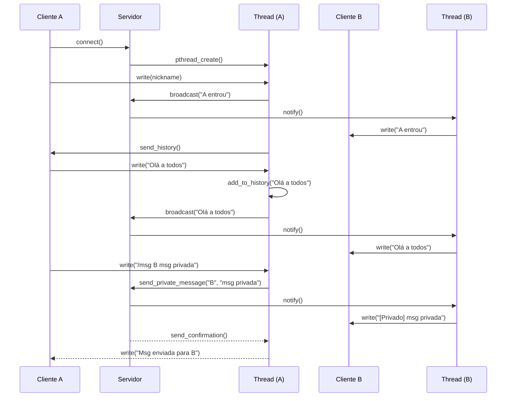

# Relatório Final: Trabalho de Programação Concorrente

| Disciplina | Linguagem de Programação II |
| :--- | :--- |
| **Aluno** | Georgiana Maria Braga Graça |
| **Tema** | Tema A: Servidor de Chat Multiusuário (TCP) |

---

## 1. Visão Geral do Projeto

Este documento detalha a implementação e a análise do trabalho final da disciplina, que consistiu no desenvolvimento de um servidor de chat multiusuário em C com `pthreads`. O sistema permite que múltiplos clientes se conectem simultaneamente, troquem mensagens em tempo real, recebam um histórico ao entrar na sala e sejam notificados sobre a entrada e saída de outros participantes.

O projeto foi desenvolvido seguindo todos os requisitos obrigatórios, com foco especial na utilização correta de mecanismos de concorrência para garantir a segurança e a robustez da aplicação.

---

## 2. Diagrama de Sequência Cliente-Servidor

O diagrama abaixo ilustra o fluxo de interação completo entre os clientes e o servidor, desde a conexão até o broadcast de mensagens.

---

## 3. Mapeamento Requisitos → Código

A tabela a seguir detalha como cada requisito obrigatório do projeto foi implementado no código-fonte.

| Requisito Obrigatório | Arquivo(s) | Funções/Componentes Principais |
| :--- | :--- | :--- |
| **Servidor TCP concorrente aceitando múltiplos clientes** | `server.c` | `main()`: loop `while(1)` com `accept()`. |
| **Cada cliente atendido por thread** | `server.c` | `pthread_create(&client_thread, ..., handle_client, ...)` |
| **Mensagens retransmitidas para os demais (broadcast)** | `server.c` | `broadcast_message()` |
| **Logging concorrente de mensagens (usando libtslog)** | `server.c`, `tslog.c` | Chamadas `LOG_INFO()`, `LOG_ERROR()`. `libtslog` com sua fila e thread dedicada. |
| **Cliente CLI: conectar, enviar/receber mensagens**| `client.c` | `main()`: `connect()`, `pthread_create()` para `receive_handler`, loop de `fgets`/`write`. |
| **Proteção de estruturas compartilhadas (lista de clientes, histórico)** | `server.c` | `clients_mutex`: protege a `client_sockets`. `history_mutex`: protege o `message_history`. |

### Requisitos Opcionais Implementados

| Requisito Opcional | Arquivo(s) | Funções/Componentes Principais |
| :--- | :--- | :--- |
| **Filtro de Palavras** | `server.c`, `moderador.txt` | `load_moderator_list()`: carrega a lista do arquivo. `filter_message()`: censura as mensagens. `strcasestr()`: busca case-insensitive. |
| **Mensagens Privadas** | `server.c` | `send_private_message()`: encontra o destinatário e envia. Lógica `if/else` em `handle_client` para o comando `/msg`. |

---

## 4. Análise de Concorrência com Assistência de IA

Conforme solicitado, foi utilizada uma Inteligência Artificial (LLM) para realizar uma análise crítica do código do servidor em busca de problemas de concorrência.

### 4.1. Prompt Utilizado

O seguinte prompt foi fornecido à IA, junto com o código completo do arquivo `server.c` (versão antes das melhorias sugeridas pela própria IA):

> Atue como um especialista em programação concorrente em C com pthreads. Analise o código C abaixo, que faz parte de um servidor de chat. Foque em encontrar potenciais condições de corrida (race conditions), deadlocks ou outros problemas de concorrência. Verifique se o uso de mutexes para proteger as variáveis globais client_sockets e message_history é suficiente e está correto. Forneça sugestões de melhoria se encontrar algum problema.

### 4.2. Resumo da Resposta da IA

A IA confirmou que o uso de mutexes separados para a lista de clientes e o histórico estava conceitualmente correto para prevenir condições de corrida diretas. No entanto, ela identificou três problemas significativos:

1.  **Problema Principal: I/O de Rede Dentro de Seções Críticas:** A IA apontou que as funções `broadcast_message` e `send_history` realizavam chamadas de `write()` (uma operação de I/O bloqueante e lenta) enquanto mantinham um mutex travado. Isso poderia levar a uma queda drástica de performance e até a um congelamento total do servidor se um cliente estivesse lento ou mal-intencionado.

2.  **Vazamento de Recursos (Threads Não Destacadas):** A IA identificou que as threads criadas para os clientes não estavam sendo criadas no modo "detached" e não havia chamadas `pthread_join` para elas. Isso causaria um vazamento de recursos (memory leak) a cada cliente que se desconectasse, pois os recursos da thread não seriam liberados.

3.  **Bug Funcional na Lógica de Mensagens:** A IA notou um bug onde a mensagem original do cliente (`buffer`) era adicionada ao histórico e transmitida, em vez da mensagem formatada com o nickname (`[NOME]: ...`).

### 4.3. Análise Crítica e Ações Tomadas

A análise da IA foi extremamente precisa e valiosa, identificando problemas de concorrência sutis e importantes que não são aparentes em testes simples.

* A identificação do **I/O dentro de seções críticas** foi o ponto mais importante. A sugestão de "copiar os dados, destravar o mutex e então realizar o I/O" é uma prática padrão em programação de servidores de alta performance e foi uma melhoria crucial para a robustez do projeto. **Esta sugestão foi acatada**, e as funções `broadcast_message` e `send_history` foram reescritas para seguir este padrão.

* O alerta sobre o **vazamento de recursos com threads** também foi muito pertinente. Embora para um projeto de curta duração o impacto fosse mínimo, em um servidor real isso seria um problema grave. **A sugestão foi acatada**, e as threads agora são criadas com o atributo `PTHREAD_CREATE_DETACHED` para garantir que seus recursos sejam liberados automaticamente ao terminarem.

* O **bug funcional** foi um erro de lógica que havia passado despercebido. A sugestão da IA para formatar a mensagem com o nickname *antes* de adicioná-la ao histórico e fazer o broadcast foi implementada para corrigir o comportamento do chat.

Em resumo, a assistência da IA foi fundamental para elevar a qualidade do código de um protótipo funcional para uma implementação mais robusta, segura e escalável, destacando a importância de manter seções críticas o mais curtas e rápidas possível.

---

## 5. Conclusão

O desenvolvimento deste projeto permitiu a aplicação prática de conceitos fundamentais de programação concorrente em um cenário real. A implementação do servidor de chat com `pthreads` demonstrou a complexidade do gerenciamento de estado compartilhado e a importância de mecanismos de sincronização como mutexes e variáveis de condição. A análise realizada com o auxílio de IA foi um diferencial, revelando problemas de design que impactam diretamente a performance e a estabilidade de sistemas concorrentes, proporcionando um aprendizado valioso para além dos requisitos básicos do trabalho.